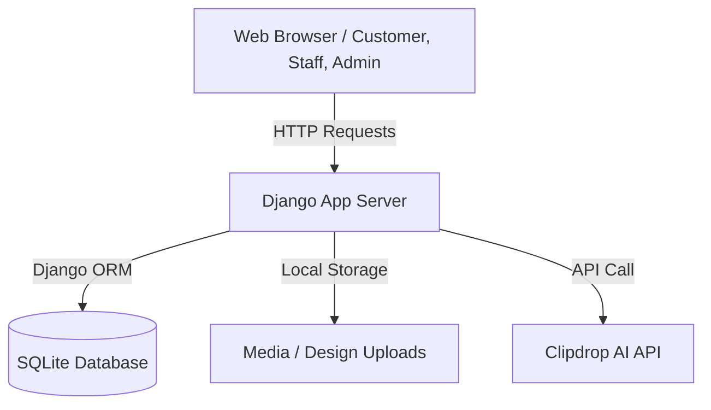

# Tailoring Management System with AI Design Generation

A modern Django-based tailoring platform that streamlines the custom order workflow. It enables users to register profiles, upload exact body measurements, choose design templates, and even generate brand-new dress designs using AI (powered by the Clipdrop text-to-image API). The system features discrete roles and workflows for Administrators, Staff, and Customers.

---

## Features

### 👤 Customer (User) Features
* **Profile Management:** Register, log in, and edit custom profiling information.
* **Measurement Profile:** Store detailed body measurements (bust, chest, waist, neck, shoulder, sleeves, bicep, wrist) for quick recall.
* **Catalog Exploration & Custom Orders:** Browse designs uploaded by the admin, select templates, fill custom measurements, upload custom images, and place orders.
* **AI Dress Generation:** Enter text prompts detailing occasion, skin tone, body type, fabric, pattern, and style to generate unique dress designs via Clipdrop AI.
* **Real-time Status & Payment Simulation:** View order history, track processing states, and process a simulated payment step.

### 👔 Staff Features
* **Dedicated Dashboard:** Track and view assigned client orders.
* **Status Updates:** Manage orders through various execution phases (e.g. accepted, production completed, shipped, delivered).

### ⚙️ Admin Features
* **Staff Management:** Create, view, update, and manage tailor staff profiles.
* **Template Catalog:** Upload new template images, specify price guidelines, add descriptions, and organize catalog items.
* **Order Oversight:** View all submitted user orders, review measurements, and assign orders to specific tailors.
* **User & Feedback Tracking:** Audit registered customers and view feedback comments.

---

## System Architecture



---

## Project Folder Structure

```text
tailoring/
│
├── tailoring/                  # Django project root configuration
│   ├── tailoring/              # Inner project configuration files
│   │   ├── settings.py         # Application settings (updated to load .env)
│   │   ├── urls.py             # Root URL routing configuration
│   │   └── wsgi.py / asgi.py   # WSGI/ASGI server entrypoints
│   │
│   ├── Admin/                  # Administrator App (Views, Templates, Models)
│   ├── staff/                  # Staff/Tailor App (Views, Templates, Models)
│   ├── user/                   # Customer App (Views, Templates, AI integration)
│   │
│   ├── Templates/              # HTML Templates (divided by Admin, Staff, User)
│   ├── static/                 # Static Assets (CSS, client JS, generated images)
│   ├── media/                  # Media directories containing customer/admin uploads
│   │
│   ├── manage.py               # Django administration utility
│   └── db.sqlite3              # Database file (ignored in repository tracking)
│
├── .env.example                # Configuration example environment file
├── .gitignore                  # Git exclusions configuration
├── requirements.txt            # Python dependencies lists
├── LICENSE                     # MIT License
├── README.md                   # Project overview and main documentation
├── INSTALLATION.md             # Step-by-step setup guides
├── PROJECT_STRUCTURE.md        # Detailed codebase folder structure description
├── CONTRIBUTING.md             # Contribution guidelines
├── CHANGELOG.md                # Release version tracking
└── CODE_OF_CONDUCT.md          # Community conduct standards
```

---

## Installation & Setup

### Prerequisites
* Python 3.10+
* Git

### Quick Setup

1. **Clone the Repository:**
   ```bash
   git clone https://github.com/your-username/tailoring.git
   cd tailoring
   ```

2. **Configure Virtual Environment:**
   * **Windows:**
     ```powershell
     python -m venv venv
     .\venv\Scripts\Activate.ps1
     ```
   * **macOS / Linux:**
     ```bash
     python3 -m venv venv
     source venv/bin/activate
     ```

3. **Install Dependencies:**
   ```bash
   pip install -r requirements.txt
   ```

4. **Environment Configuration:**
   Copy the example environment file and update with your actual Clipdrop API key:
   * **Windows:**
     ```powershell
     copy .env.example .env
     ```
   * **macOS / Linux:**
     ```bash
     cp .env.example .env
     ```
   Open `.env` and set `CLIPDROP_API_KEY` to your valid token.

5. **Database Migrations:**
   ```bash
   python tailoring/manage.py migrate
   ```

6. **Start the Development Server:**
   ```bash
   python tailoring/manage.py runserver
   ```
   Access the system at `http://127.0.0.1:8000/`.

---

## Usage Guide
* **Admin Login:** Access administration tools under `http://127.0.0.1:8000/admin_log/`.
* **Staff Panel:** Tailors can sign in and update progress at `http://127.0.0.1:8000/staff/user_login`.
* **Customer Hub:** Customers can access their profile, order designs, and generate garments via AI at `http://127.0.0.1:8000/user/user_login`.

---

## Screenshots
*(Placeholders - update these with interface screen grabs once deployed)*
* **Customer Dashboard & Measurements View:** `docs/screenshots/user_dashboard.png`
* **AI Dress Generator Tool:** `docs/screenshots/ai_generation.png`
* **Admin Order Assignment Screen:** `docs/screenshots/admin_panel.png`

---

## Troubleshooting
* **Missing API Key Error:** Ensure the `.env` file exists at the repository root and contains `CLIPDROP_API_KEY`.
* **Media Folder Permissions:** Ensure write permissions are enabled on the `tailoring/media/` folder to support design uploads.
* **SQLite Database Lock:** Close active database clients if Django shows a "database is locked" warning.

---

## Future Improvements
* Integration of real-time SMS notifications for order progress updates.
* Multi-payment gateway integrations (Stripe, PayPal, etc.).
* Mobile responsive front-end redesign.

---

## Authors
* **Tailoring App Contributors** - Development & Architecture
* Open-sourced under the [MIT License](file:///C:/Users/stina/OneDrive/Desktop/tailoring/LICENSE).
